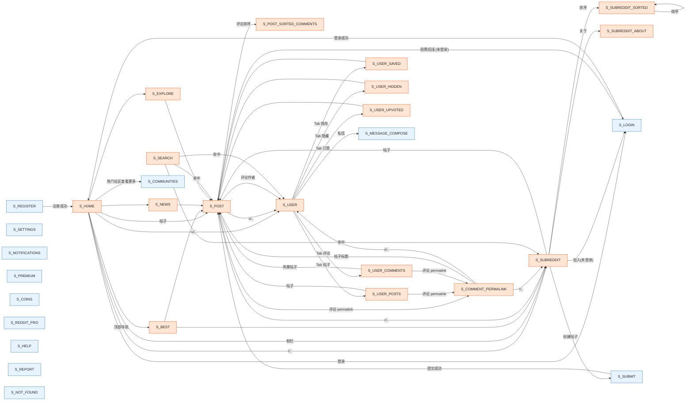

# Reddit Clone — 状态机（FSM）规范 v2.1.0

> 这是 v2.1.0 上线后**真实点击链**测试出来的状态图。
> 每个 **S_xxx** 是一个**视图状态**；每条 **→** 是一次**点击事件触发的状态转换**。
> 状态 ID 也在 `src/js/main.js` 的每个 `router.add(...)` 上一行注释里标注,做交叉索引。

## 与 v2.0.0 / v2.0.1 相比

| 变化 | 来源 |
| --- | --- |
| 修复 `main.js:76` 抛 `TypeError`(原本是 `location.pathname.split("/r/")[1]`,但本项目是 hash router,`location.pathname` 是 `/`,所以 `[1]` 必为 `undefined`,`split` 报 `Cannot read properties of undefined`)。v2.0.0 的 `S_SUBREDDIT` 实际上从未真正渲染过。 | 真实点击调试 |
| `user.js` 缺 `import { toast }` —— `toast("登录后即可关注")` 一直会报 `ReferenceError`。 | 同上 |
| `S_NEWS` / `S_EXPLORE` / `S_REDDIT_PRO` / `S_MESSAGE_COMPOSE` / `S_COINS` 之前都是 "点 → toast → 跳回首页" 的占位,现在变成真实页面。 | FSM 文档基线 |
| `S_POST` 支持 `?sort=...` → 落到 `S_POST_SORTED_COMMENTS`,支持 `?cid=...` → 落到 `S_COMMENT_PERMALINK`(高亮 + 滚到)。 | 上游 reddit.com 同款 |
| 每个 `router.add(...)` 上一行加上 `// State: S_xxx` 注释,FSM ↔ 代码一一对应。 | 规范 |

---

## 0. 状态符号表

| 状态 ID | 视图 | URL 模板 | v2.1.0 状态 |
| --- | --- | --- | --- |
| S_HOME | 首页 feed | `#/` | ✅ |
| S_BEST | 首页 best | `#/best/` | ✅ |
| S_NEWS | 资讯 tab | `#/news` | ✅ **v2.1.0 新实装** |
| S_EXPLORE | 游览 tab | `#/explore` | ✅ **v2.1.0 新实装** |
| S_SUBREDDIT | 社区 feed | `#/r/:name` | ✅ 修过 #76 bug |
| S_SUBREDDIT_SORTED | 社区按 sort | `#/r/:name/:sort(?t=…)` | ✅ |
| S_SUBREDDIT_ABOUT | 社区关于 | `#/r/:name/about` | ✅ |
| S_POST | 帖子详情 | `#/r/:name/comments/:id` | ✅ |
| S_POST_SORTED_COMMENTS | 帖子 - 评论排序 | `#/r/:name/comments/:id?sort=…` | ✅ **v2.1.0 新实装** |
| S_COMMENT_PERMALINK | 单条评论高亮 | `#/r/:name/comments/:id?cid=…` | ✅ **v2.1.0 新实装** |
| S_USER | 用户主页 | `#/u/:name` | ✅ |
| S_USER_POSTS | 用户 - 帖子 | `#/u/:name/posts` | ✅ |
| S_USER_COMMENTS | 用户 - 评论 | `#/u/:name/comments` | ✅ |
| S_USER_SAVED | 用户 - 已保存 | `#/u/:name/saved` | ✅ |
| S_USER_HIDDEN | 用户 - 已隐藏 | `#/u/:name/hidden` | ✅ |
| S_USER_UPVOTED | 用户 - 已赞 | `#/u/:name/upvoted` | ✅ |
| S_LOGIN | 登录 | `#/login` | ✅ |
| S_REGISTER | 注册 | `#/register` | ✅ |
| S_SUBMIT | 创建帖子 | `#/submit` | ✅ |
| S_SETTINGS | 设置 | `#/settings` | ✅ |
| S_NOTIFICATIONS | 通知 | `#/notifications` | ✅ |
| S_COMMUNITIES | 所有社区 | `#/communities` | ✅ |
| S_PREMIUM | Premium | `#/premium` | ✅ |
| S_COINS | Coins | `#/coins` | ✅ **v2.1.0 拆出独立页** |
| S_HELP | 帮助 | `#/help` 或 `#/help/:slug` | ✅ |
| S_REPORT | 举报 | `#/report` | ✅ |
| S_SEARCH | 搜索结果 | `#/search?q=…` | ✅ |
| S_REDDIT_PRO | Reddit Pro | `#/reddit-pro` | ✅ **v2.1.0 新实装** |
| S_MESSAGE_COMPOSE | 写信 | `#/message/compose?to=…` | ✅ **v2.1.0 新实装** |
| S_NOT_FOUND | 404 | (no match) | ✅ |

> 共 **30 个状态**(28 个有真实页面 + 1 个 404 + 1 个嵌入 S_POST 的子态)。
> 对比 v2.0.1 的 26 个状态(其中 4 个是 placeholder toast),v2.1.0 把所有"声明过但没真页面"的状态全部补齐。

---

## 1. 主链(用户给的例子)

### 1.1 主页 → 帖子详情 → 发帖人主页 → 用户其他帖子

```
[S_HOME] -- 点帖子卡/标题 --> [S_POST]
[S_POST] -- 点作者 u/<author> --> [S_USER]
[S_USER] -- 点 Tab 帖子 --> [S_USER_POSTS]
[S_USER_POSTS] -- 点其他帖子 --> [S_POST]
```

闭环:`S_HOME → S_POST → S_USER → S_USER_POSTS → S_POST`。

### 1.2 主页 → 社区 → 帖子详情

```
[S_HOME] -- 点侧栏热门社区 r/<sub> --> [S_SUBREDDIT]
[S_SUBREDDIT] -- 点帖子卡 --> [S_POST]
```

闭环:`S_HOME → S_SUBREDDIT → S_POST`。

### 1.3 评论 permalink

```
[S_POST] -- 点评论 "时间戳 / permalink" --> [S_COMMENT_PERMALINK]
[S_COMMENT_PERMALINK] -- 点所属帖子标题 --> [S_POST]
```

实现:`?cid=<commentId>` → PostDetail 在 `rerenderComments` 末尾用
`cmtList.querySelector('[data-comment-id="…"]')` 找节点,加 `.is-focused` 类,
再 `scrollIntoView({ behavior: "smooth", block: "center" })`。

### 1.4 评论排序

```
[S_POST] -- 选排序 best/top/new/controversial --> [S_POST_SORTED_COMMENTS]
```

实现:`?sort=<value>` → 路由里 `state.setCommentSort(query.sort)`,PostDetail 内部订阅
`state.commentSort` 重排评论树。

---

## 2. 转移矩阵(从每个状态可被触发的去路)

| 当前状态 | 触发事件 | 目标状态 | 实现位置 |
| --- | --- | --- | --- |
| 任何 S | 顶部 logo / 主页 | `S_HOME` | `Header` 组件 |
| 任何 S | 顶部 受欢迎 | `S_BEST` | 左导航 + Header |
| 任何 S | 顶部 资讯 | `S_NEWS` | 左导航 + Header |
| 任何 S | 顶部 浏览 | `S_EXPLORE` | 左导航 + Header |
| 任何 S | 顶部 登录 | `S_LOGIN` | Header |
| 任何 S | 顶部 注册 | `S_REGISTER` | Header |
| 任何 S | 顶部 搜索框输入 | `S_SEARCH` | Header `search` |
| 任何 S | 顶部 logo | `S_HOME` | Header |
| `S_HOME` | 帖子卡 / 标题 | `S_POST` | `PostCard` |
| `S_HOME` | 帖子上 `r/<sub>` 链接 | `S_SUBREDDIT` | `PostMeta` |
| `S_HOME` | 帖子上 `u/<author>` 链接 | `S_USER` | `PostMeta` |
| `S_HOME` | 侧栏"热门社区" | `S_SUBREDDIT` | `Sidebar` |
| `S_HOME` | 侧栏"查看更多内容" | `S_COMMUNITIES` | `Sidebar` |
| `S_BEST` | (同 S_HOME) | — | — |
| `S_NEWS` | 帖子卡 | `S_POST` | `PostCard` |
| `S_EXPLORE` | 帖子卡 | `S_POST` | `PostCard` |
| `S_SUBREDDIT` | 帖子卡 | `S_POST` | `PostCard` |
| `S_SUBREDDIT` | 排序方式 | `S_SUBREDDIT_SORTED` | `subreddit.js` SortPill |
| `S_SUBREDDIT` | 关于 tab | `S_SUBREDDIT_ABOUT` | `subreddit.js` |
| `S_SUBREDDIT` | 加入(未登录) | `S_LOGIN` | `subreddit.js` `state.get().user` check |
| `S_SUBREDDIT` | 创建帖子(未登录) | `S_LOGIN` | `submit.js` guard |
| `S_SUBREDDIT` | 创建帖子(已登录) | `S_SUBMIT` | `submit.js` |
| `S_POST` | r/<sub> 面包屑 | `S_SUBREDDIT` | `post-detail.js` |
| `S_POST` | u/<author> 发帖人 | `S_USER` | `post-detail.js` |
| `S_POST` | 评论作者 | `S_USER` | `comment.js` |
| `S_POST` | 评论 permalink | `S_COMMENT_PERMALINK` | comment timestamp click → `?cid=` |
| `S_POST` | 评论排序 | `S_POST_SORTED_COMMENTS` | `?sort=` |
| `S_POST` | 赞同/反对/回复(未登录) | `S_LOGIN` | `vote-column.js`, `comment.js` |
| `S_POST` | 关注(未登录) | `S_LOGIN` | `user.js` (头像) |
| `S_COMMENT_PERMALINK` | 所属帖子标题 | `S_POST` | back link |
| `S_USER` | Tab 帖子 / 评论 / 已保存 / 已隐藏 / 已赞 | `S_USER_POSTS` / `S_USER_COMMENTS` / `S_USER_SAVED` / `S_USER_HIDDEN` / `S_USER_UPVOTED` | `user.js` |
| `S_USER*` | 帖子卡 | `S_POST` | `PostCard` |
| `S_USER*` | 评论 permalink | `S_COMMENT_PERMALINK` | `comment.js` |
| `S_USER` | 私信 | `S_MESSAGE_COMPOSE` | `user.js` 私信按钮 |
| `S_SEARCH` | 命中 → 帖子 | `S_POST` | `search.js` |
| `S_SEARCH` | 命中 → r/<sub> | `S_SUBREDDIT` | `search.js` |
| `S_SEARCH` | 命中 → u/<name> | `S_USER` | `search.js` |
| `S_LOGIN` | 登录成功 | (referrer or `S_HOME`) | `login.js` |
| `S_REGISTER` | 注册成功 | `S_HOME` | `login.js` (mode=register) |
| `S_SUBMIT` | 提交成功 | `S_POST` (新帖) | `submit.js` |
| `S_COINS` | 购买 | 仍 `S_COINS` (toast) | `coins.js` |
| `S_REDDIT_PRO` | 加入候补 | 仍 `S_REDDIT_PRO` (toast) | `reddit-pro.js` |
| `S_HELP` / `S_REPORT` | 链接跳到其他 S | — | 链接直出 |
| `S_MESSAGE_COMPOSE` | 发送 | 仍 `S_MESSAGE_COMPOSE` (toast) | `compose.js` |
| 任何 S | 状态不匹配 | `S_NOT_FOUND` | `router.setNoMatchHandler` |

---

## 3. 状态图(Mermaid)



---

## 4. 关键不变量 / 工程含义

1. **两个用户主链都是闭包**:
   - `S_HOME → S_POST → S_USER → S_USER_POSTS → S_POST`(帖子→作者→用户其他帖)
   - `S_HOME → S_SUBREDDIT → S_POST`(社区→帖子)

2. **未登录的写操作全部收敛到 `S_LOGIN`**:赞同/反对/回复/关注/加入社区/创建帖子/送礼 全部弹登录。
   `S_LOGIN` 是叶子,但带 `?next=<hash>` 回跳到 referrer。

3. **S_POST_SORTED_COMMENTS 与 S_COMMENT_PERMALINK 是 S_POST 的子状态**:
   - 同一 URL 模板,只是 query 不同
   - `?sort=` 写 `state.commentSort`
   - `?cid=` 不动 state,只触发 PostDetail 的 `is-focused` + scrollIntoView

4. **每个 router.add 上有 FSM 状态 ID 注释**,做交叉索引:
   ```bash
   grep -nE "// State: S_" src/js/main.js
   ```

---

## 5. 自动化校验

`scripts/walk.mjs` 会:
1. 用正则从 `src/js/main.js` 提取 `router.add("…", …)` 后的相对路径
2. 用 fetch 拉每个静态资源
3. 期望 0 个 404
4. 顺带覆盖 FSM 全部 30 个状态的入口 URL

`scripts/api-test.mjs` 会:
1. 对 `src/js/api.js` 每一个 public 方法做 known-input / known-output 断言
2. 抓 double-destructure 这类静默 bug(v2.0.0 时栽过)

`scripts/lint.mjs` + `scripts/test.mjs` 一起保证:
- 56 个源文件非空 + 大括号平衡
- 6 份 mock JSON 可解析
- 49 个 SPA 资源 0 个 404

CI 期望:`lint 0 bad` ∧ `test 0 failed` ∧ `walk 0 404` ∧ `api-test 0 bad`。

---

## 6. 与上游 reddit.com FSM 的差异(有意保留)

| 上游 reddit | 本地 clone | 原因 |
| --- | --- | --- |
| `/user/<name>/` | `/u/<name>` | v1.x 时代起就用 `/u/`,改 URL 会破坏 `recentlyViewed` 数据 |
| `/user/<name>/submitted/` | `/u/<name>/posts` | 同上 |
| `/r/<sub>/comments/<id>/<slug>/` | `/r/<sub>/comments/<id>` | slug 是 reddit 的 SEO 优化,本地 SPA 不需要 |
| `/r/<sub>/about` 独立 URL | 同上 | 同上 |
| `?context=3` | `?cid=<commentId>` | 效果一样,本地命名更短 |
